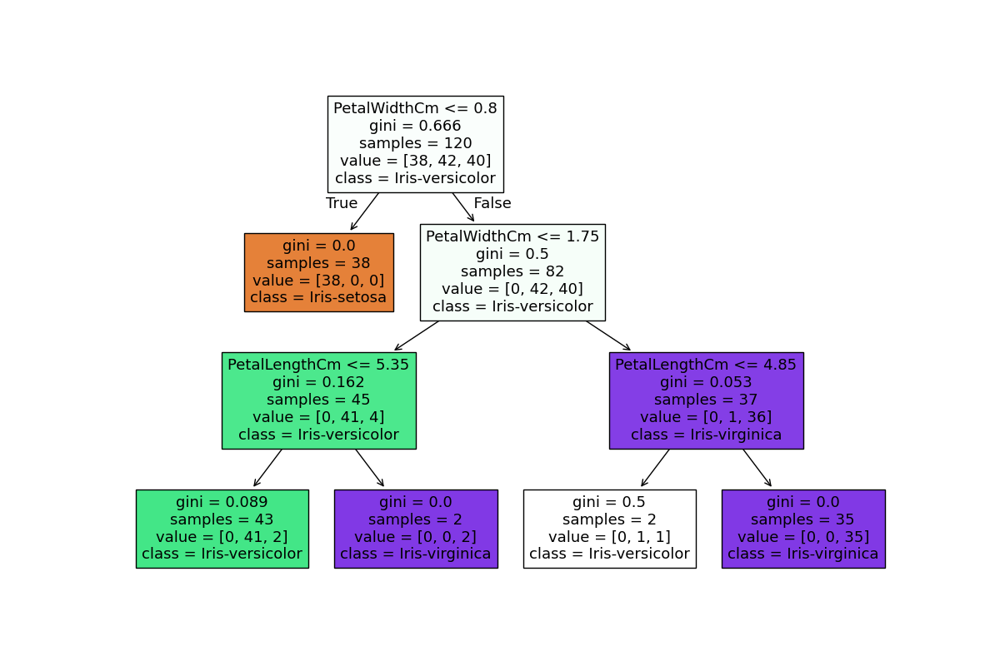
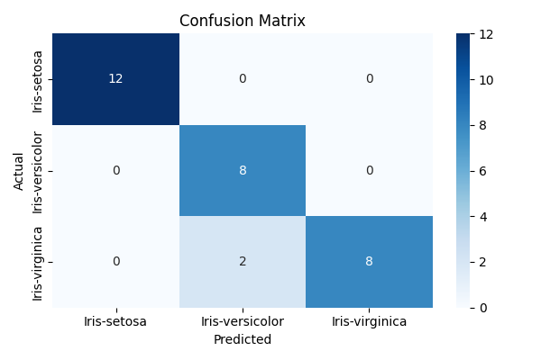

# 🌸 Iris Flower Classification - Decision Tree Classifier

This project uses a Decision Tree Classifier to predict the species of an iris flower based on its features. We utilize the classic **Iris dataset**, apply **hyperparameter tuning**, and visualize the model and performance using a decision tree plot and confusion matrix.

---

## 📊 Dataset

The dataset used is the Iris dataset, which includes:

- Sepal length (cm)
- Sepal width (cm)
- Petal length (cm)
- Petal width (cm)
- Species (Target variable)

---

## 🚀 Workflow

1. Load and preprocess the dataset
2. Train/test split
3. Apply GridSearchCV for hyperparameter tuning
4. Evaluate model accuracy
5. Visualize:
   - Decision tree
   - Confusion matrix

---

## 🧠 Best Model Parameters

The model is optimized using `GridSearchCV` with 5-fold cross-validation. The grid search tunes:

- `criterion`: gini / entropy
- `max_depth`: 3, 5, 7, None
- `min_samples_split`: 2, 5, 10
- `min_samples_leaf`: 2, 3, 5

---

## 📈 Results

- **Accuracy**: 93.33%

---

## 📷 Output Visualizations

### 🌲 Decision Tree



### 🔍 Confusion Matrix



---

## ⚙️ Requirements

Install dependencies using:

```bash
pip install -r requirements.txt
