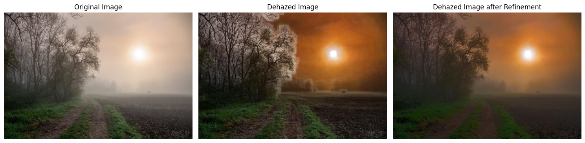

# Image Dehazing using Dark Channel Prior and Guided Filtering

This project demonstrates image dehazing using the **Dark Channel Prior** and **Guided Filtering** techniques to improve visibility in hazy images.

## Overview
In this project, we focus on removing haze from images by estimating the atmospheric light and transmission map using the Dark Channel Prior method. The transmission map is refined using Guided Filtering to enhance the clarity of the image. This project utilizes OpenCV, Matplotlib, and NumPy libraries for image processing and visualization.

### Key Techniques
- **Dark Channel Prior**: A method to estimate the transmission map by finding the minimum intensity of each pixel across the RGB channels.
- **Guided Filtering**: A technique to refine the transmission map, which helps in restoring finer details during the dehazing process.

## Requirements

To run this project, make sure to install the required dependencies. You can install them using the following command:

```bash
pip install -r requirements.txt
```

## Explanation

### 1. **Loading and Preprocessing the Image**
   The image is loaded using OpenCV, converted from BGR to RGB format, and normalized to ensure pixel values are in the range of `[0, 255]`.

### 2. **Dark Channel Prior**
   The **Dark Channel Prior** method is used to calculate the dark channel of the image. This technique uses the minimum intensity of each pixel across the RGB channels to estimate the transmission map. This helps identify regions in the image where the haze is more pronounced.

   To calculate the dark channel:
   - For each pixel, take the minimum value across the red, green, and blue channels.
   - Apply a morphological erosion to highlight the darkest pixels.

### 3. **Atmospheric Light Estimation**
   The **Atmospheric Light** (A) is estimated from the brightest pixels in the dark channel. These are typically the pixels with the most haze, and they help us determine the overall atmospheric light in the scene.

   The brightest pixels are selected from the dark channel, and their corresponding values in the original image are used to estimate A.

### 4. **Transmission Estimation**
   The **Transmission Map** (T) is estimated by using the formula:
   \[
   T(x) = 1 - \omega \cdot D(x)
   \]
   where \(D(x)\) is the dark channel of the image and \(\omega\) is a constant (usually set to 0.95). This formula assumes that the transmission is inversely proportional to the amount of haze in the dark channel.

### 5. **Guided Filtering**
   The transmission map is refined using **Guided Filtering**, which is a method for edge-preserving smoothing. It uses the original image as a guide to refine the transmission map, reducing noise and improving the clarity of the dehazed image.

   This step ensures that the refined transmission map better captures fine details, avoiding the blurring that might happen in uniform regions.

### 6. **Recovering the Scene Radiance**
   The **Scene Radiance** (the dehazed image) is recovered using the following formula:
   \[
   J(x) = rac{I(x) - A}{T(x)} + A
   \]
   where \(I(x)\) is the hazy image, \(A\) is the atmospheric light, and \(T(x)\) is the transmission map. This formula uses the atmospheric light and transmission to estimate the clear image (scene radiance).

   The refined transmission map is used to obtain a more detailed and accurate dehazed image.

### 7. **Visualizing Results**
   Finally, the following images are visualized for comparison:
   - **Original Hazy Image**: The input image with haze.
   - **Dark Channel**: The calculated dark channel of the image.
   - **Dehazed Image**: The output image after applying the Dark Channel Prior.
   - **Refined Dehazed Image**: The final image after refining the transmission map using Guided Filtering.

## Sample Output



## Results
- The dehazed image shows improved visibility and contrast compared to the original hazy image.
- The refined transmission map helps in reducing halo effects, providing a clearer result.

## Conclusion
This project demonstrates an effective technique for removing haze from images using the Dark Channel Prior and Guided Filtering. It is a crucial step toward improving visibility in images captured in foggy or hazy conditions.

