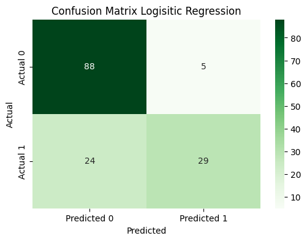
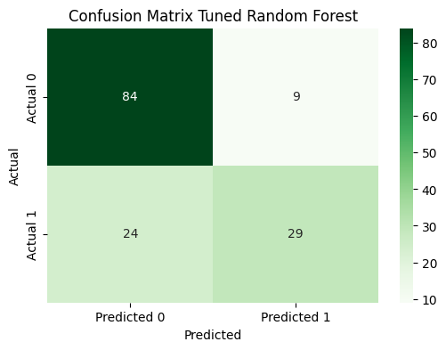

# 🩺 Diabetes Prediction using Decision Tree

This project uses the **Diabetes Dataset** and applies a **Decision gTree Classifier** to predict whether a patient has diabetes based on diagnostic measurements.

---

## 📊 Dataset

- Source: [Diabetes Dataset](https://github.com/Bhavya-Mistry/ML/blob/main/DecisionTree/Diabetes-Prediction/Dataset/diabetess.csv)
- Rows: 768
- Columns: 9 (8 features + 1 target)

### Features:
- `Pregnancies`: Number of times pregnant
- `Glucose`: Plasma glucose concentration
- `BloodPressure`: Diastolic blood pressure (mm Hg)
- `SkinThickness`: Triceps skinfold thickness (mm)
- `Insulin`: 2-Hour serum insulin (mu U/ml)
- `BMI`: Body mass index
- `DiabetesPedigreeFunction`: Diabetes pedigree function
- `Age`: Age (years)

### Target:
- `Outcome`: 1 (diabetic), 0 (non-diabetic)

---

## 🧠 Model

- **Model Used**: `DecisionTreeClassifier` and `Logistic Regression`
- **Train-Test Split**: 80% training / 20% testing
- **Performance Metric**: Accuracy

---

## 📈 Result

- ✅ Achieved accuracy [Random Forest]: ~77%
- ✅ Achieved accuracy [Logistic Regression]: ~80%
---

## 🖼️ Output-Images





---

## 🛠️ Requirements

Install all dependencies using:

```bash
pip install -r requirements.txt
