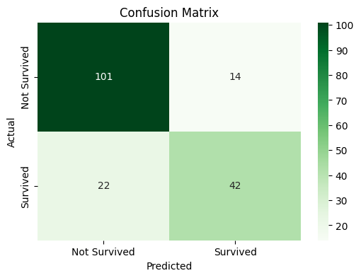

# Titanic Survival Prediction

This project is a machine learning classification task aimed at predicting whether passengers survived the Titanic disaster based on various features such as age, gender, class, and other details.

## Project Overview

The goal of this project is to predict survival on the Titanic using a Decision Tree classifier with hyperparameter tuning. The dataset used is the Titanic dataset, which contains both passenger information and their survival status. This project covers:

- **Data Preprocessing**: Handling missing values, encoding categorical variables, and feature engineering.
- **Model Training**: Using a Decision Tree classifier and applying GridSearchCV for hyperparameter tuning.
- **Model Evaluation**: Performance evaluation using accuracy, confusion matrix, and classification report.

## Dataset

The dataset is sourced from the Kaggle Titanic competition. The key features in the dataset include:

- Pclass: Passenger class (1st, 2nd, or 3rd)

- Age: Age of the passenger

- SibSp: Number of siblings or spouses aboard the Titanic

- Parch: Number of parents or children aboard the Titanic

- Fare: Fare paid by the passenger

- Sex: Gender of the passenger

- Embarked: Port of Embarkation (C = Cherbourg; Q = Queenstown; S = Southampton)

- Survived: Survival status (0 = No, 1 = Yes)

## Data Preprocessing
The following preprocessing steps were performed on the data:

1. Handling Missing Values:

 - Missing values in the `Age` column were filled using the median value within each `Pclass`.

 - Missing values in the `Embarked` column were filled with the most frequent (mode) value.

2. Encoding Categorical Variables:

 - The `Sex` column was LabelEncoded (male = 0, female = 1).

 - The `Embarked` column was one-hot encoded into separate columns for each port.

3. Feature Engineering:

Extracted the relevant features: `Pclass`, `Age`, `SibSp`, `Parch`, `Fare`, `Sex`, `Embarked` for model training.

## Model Training
A Decision Tree Classifier was used to predict passenger survival. The model was fine-tuned using GridSearchCV to find the best hyperparameters:

- `max_depth`: Maximum depth of the tree.

- `min_samples_split`: Minimum number of samples required to split a node.

- `min_samples_leaf`: Minimum number of samples required to be at a leaf node.

- `criterion`: The function used to measure the quality of a split (Gini impurity or entropy).

## Model Evaluation
After training the model, it was evaluated on the test set using the following metrics:

- Accuracy: The overall accuracy of the model on the test set.

- Confusion Matrix: A matrix showing the number of true positives, true negatives, false positives, and false negatives.

- Classification Report: A detailed classification report with precision, recall, and F1-score for both classes (Survived and Not Survived).

## Output 



## Requirements

Ensure you have the following libraries installed:

```bash
pip install pandas numpy scikit-learn seaborn matplotlib
