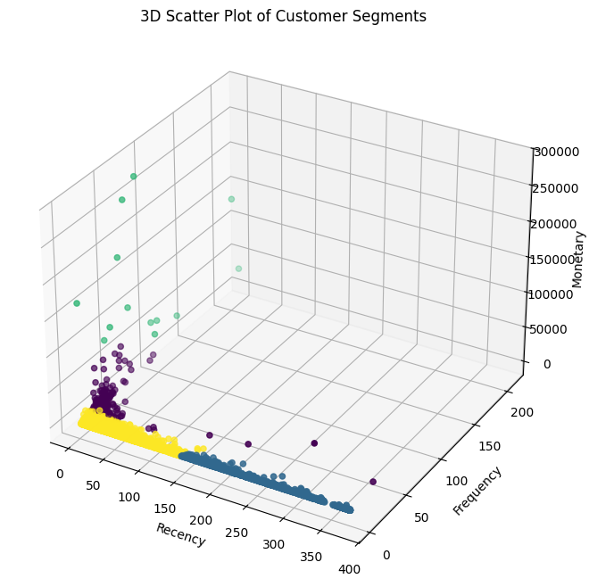

# 🛍️ Customer Segmentation Using RFM and K-Means Clustering
This project applies RFM (Recency, Frequency, Monetary) analysis combined with K-Means clustering to segment customers of an online retail store. The analysis helps businesses better understand customer behavior and tailor their marketing strategies effectively.

## 📊 Project Overview
This notebook performs the following key steps:

- Data Cleaning and Preparation

- RFM Feature Engineering

- Feature Scaling

- K-Means Clustering

- Elbow Method for Optimal k

- Cluster Visualization (2D & 3D)

- Cluster Interpretation and Labeling

## Model Saving for Deployment

### **Dataset**
The dataset used is the UCI Online Retail dataset which contains transactional data of a UK-based online retailer between 2010 and 2011.

| Feature     | Description                         |
|-------------|-------------------------------------|
| InvoiceNo   | Invoice number                      |
| StockCode   | Product/item code                   |
| Description | Product description                 |
| Quantity    | Number of items purchased           |
| InvoiceDate | Date and time of purchase           |
| UnitPrice   | Price per item                      |
| CustomerID  | Unique ID of the customer           |
| Country     | Country of residence of the customer|

## Requirements

**Install the required Python packages:**
``
pip install -r reqiurements.txt``

## Visualizations
Elbow Curve to determine optimal clusters (k)

3D Scatter Plot of clusters based on RFM

Heatmap of cluster centers

Bar Plot of customer count in each cluster

## Web Interface
 **A simple web interface created using streamlit**

